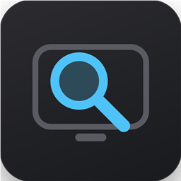
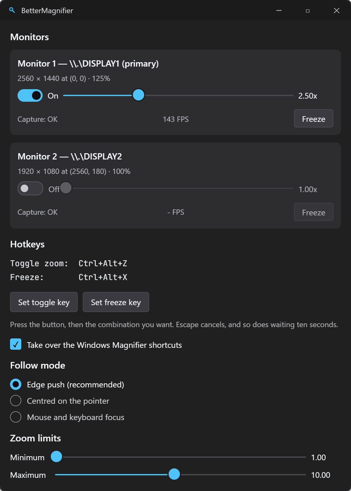

<div align="center">



# BetterMagnifier

[](https://github.com/mertemr/BetterMagnifier/actions/workflows/build.yml)
[](LICENSE)
[](../../releases/latest)

</div>

A live screen magnifier for Windows 11/10 with the one thing the built-in
Windows Magnifier cannot do: **an independent zoom level per monitor.**

Toggle magnification on one display while the rest stay untouched, each at
its own zoom, with a composited pointer, edge-push panning, and an on-screen
readout — all driven by hotkeys or a control panel.

> Actively developed, pre-1.0. Core magnification, per-monitor zoom, edge-push
> panning and the control panel all work; a few interactive paths in the panel
> haven't been exercised by hand yet. See
> [`docs/ARCHITECTURE.md`](docs/ARCHITECTURE.md#known-limitations) for the
> honest list.

## Features

- **Per-monitor zoom.** Each display has its own on/off state and zoom level;
  magnifying one does not touch the others.
- **Edge-push panning by default.** The view holds still while the pointer
  moves inside it and scrolls only once the pointer reaches a band near the
  edge — far calmer to read than a view that tracks every mouse twitch.
  Classic pointer-centred panning is available too.
- **A magnified, composited cursor**, scaled and positioned so clicks land
  where the sprite appears to point — not where the real, tiny cursor
  actually is.
- **On-screen readout.** A brief `2.50x` / `Frozen` indicator appears at the
  bottom of the screen when the zoom level or freeze state changes.
- **Freeze.** Pin the magnified view in place while the pointer keeps moving
  freely underneath it.
- **Hotkeys**, rebindable from the panel by pressing the combination you
  want — no typing, no format to get wrong:
  - `Ctrl+Alt+Z` — toggle zoom on the monitor under the pointer
  - `Ctrl+Alt+X` — freeze / unfreeze
  - `Win+Plus` / `Win+Minus` — step zoom in / out (optionally takes over the
    Windows Magnifier's own shortcuts)
  - `Ctrl+Alt+Mouse wheel` — step zoom in / out
  - `Win+middle-click` — freeze
  - `Ctrl+Alt+Shift+Q` — panic exit, always works even if the render thread
    has wedged
- **A control panel** (tray icon → Settings) with a live card per monitor,
  zoom limits, pointer tuning, follow mode, and a *Reload from disk* button
  for hand-editing `settings.ini`.
- **Survives locking the workstation.** Capture and input hooks both recover
  automatically after unlock.

## Screenshots



The control panel: one live card per monitor, hotkeys captured by pressing
them, follow mode, and zoom limits.

## Requirements

- Windows 10 or 11, 64-bit
- A GPU with a Direct3D 11 driver
- Administrator rights — see [why](docs/ARCHITECTURE.md#known-limitations) in
  the architecture doc; the short version is that low-level input hooks need
  the elevation to reliably see input from other elevated windows

## Getting started

Download the latest build from [Releases](../../releases), extract it
anywhere, and run `BetterMagnifier.exe`. Windows will ask for administrator
approval on every launch — that's the manifest, not a bug.

- **Toggle zoom:** `Ctrl+Alt+Z`, or the tray icon
- **Settings:** right-click the tray icon → Settings
- **Quit:** tray icon → Exit, or `Ctrl+Alt+Shift+Q` if something has gone wrong

Settings live at `%APPDATA%\BetterMagnifier\settings.ini`.

## Building from source

Requires Visual Studio 2022 (or newer) with the **Desktop development with
C++** workload and a recent Windows SDK. The control panel pulls in the
Windows App SDK via NuGet, so an internet connection is needed for the first
build.

```powershell
git clone https://github.com/mertemr/BetterMagnifier.git
cd BetterMagnifier
.\bm.ps1 run     # builds Debug x64 and launches it
```

`bm.ps1` wraps MSBuild so you don't need a Developer PowerShell:

```
.\bm.ps1            # build Debug
.\bm.ps1 run        # build Debug, then launch
.\bm.ps1 release    # build Release
.\bm.ps1 check      # build Debug + run the diagnostic modes (elevates once)
.\bm.ps1 errors     # WARN/ERROR lines from the newest log
.\bm.ps1 log        # show the newest log file
.\bm.ps1 kill       # kill running instances
.\bm.ps1 clean      # delete bin and obj
```

`TreatWarningAsError` is on for both configurations — a build is either clean
or it fails.

## How it's built

Three threads (render, input, GUI), no shared mutable state on the hot path,
D3D11 + Desktop Duplication for capture, and a from-scratch magnification
transform that keeps the composited cursor and click alignment consistent
under panning and zoom changes.

The full design — why it needs three threads, why the cursor is drawn by the
app instead of the OS, why administrator rights are required, and what
doesn't work yet — is in [`docs/ARCHITECTURE.md`](docs/ARCHITECTURE.md).

## Contributing

Issues and pull requests are welcome. If you're touching `src/`, read
[`docs/ARCHITECTURE.md`](docs/ARCHITECTURE.md) first — most of the constraints
in this codebase (why hooks live on their own thread, why the panel has no
text boxes, why elevation is required) look arbitrary until you know the
reason, and the reason is usually a crash or a subtle bug that already
happened once.

## License

[Apache License 2.0](LICENSE).
